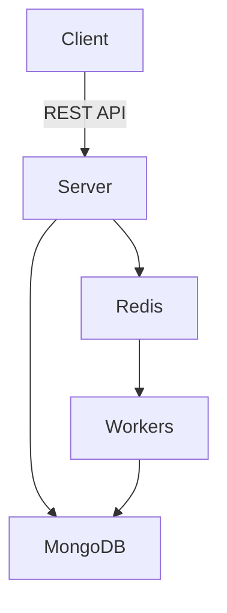

# System Design: Knovator

This document outlines the high-level system design of the `Knovator` project, which is a scalable job queue and authentication platform using modern frontend and backend technologies.

---

## 📦 Overview

The system is designed to:

* Handle user authentication (email + Google OAuth)
* Allow to submit jobs
* Queue jobs using Redis + BullMQ
* Process jobs asynchronously using workers
* Provide a responsive frontend using Next.js

---

## ⚙️ Architecture Components

### 1. **Frontend (Next.js 15)**

* **Framework**: Next.js App Router
* **State Management**: Redux Toolkit
* **Theming**: Dark/Light toggle using system preference and Redux
* **Auth Integration**: Google OAuth (client-side) + JWT (server-side)
* **API Communication**: REST via Axios or Fetch

### 2. **Backend (Node.js with Express)**

* **Database**: MongoDB for persistent storage (users, jobs, logs)
* **Cache & Queue Store**: Redis
* **Job Queue**: BullMQ (Redis-based queue)
* **Authentication**: JWT middleware with access/refresh tokens
* **Worker Threads**: Two separate worker files to enqueue and dequeue jobs

### 3. **Queue System**

* **Enqueue Worker**: Picks up tasks (e.g., from DB or HTTP requests) and adds them to the Redis queue
* **Dequeue Worker**: Listens to the queue and processes jobs one by one (or concurrently)
* **Retry/Failure Handling**: Implemented using BullMQ's built-in mechanisms

---

## 🧱 Database Design

### Users

```json
{
  _id: ObjectId,
  name: String,
  email: String,
  password: String (hashed),
  googleId: String?,
  createdAt: Date
}
```

### Jobs

```json
{
  _id: ObjectId,
  title: String,
  status: String (pending | processing | done | failed),
  userId: ObjectId,
  createdAt: Date,
  updatedAt: Date
}
```

### Logs

```json
{
  timestamp: Date,
  totalFetched: Number,
  totalImported: Number,
  newJobs: Number,
  updatedJobs: Number,
  failedJobs: [ { jobId, reason } ]
}
```

---

## 🔒 Authentication Flow

1. User signs in via Email or Google.
2. On success, backend returns a signed JWT.
3. JWT is stored in cookies (HttpOnly recommended).
4. Auth middleware on the backend verifies token for protected routes.

---

## 🔄 Job Lifecycle

1. **worker Action**: A triggers a job cron job which run every hour.
2. **Enqueue**: Job details are added to Redis queue by the `enqueue.worker.js`
3. **Processing**: `dequeue.worker.js` picks jobs from the queue
4. **Database Update**: Job status is updated in MongoDB
5. **Error Handling**: Failures are logged in the `logs` collection

---

## 🌍 API Endpoints

### Auth

* `POST /api/v1/user/register`
* `POST /api/v1/user/login`
* `GET /api/v1/user/current`

### Jobs

* `POST /api/v1/jobs/job-logs`
* `GET /api/v1/jobs/all`
* `GET /api/v1/jobs/status/:id`

---

## ⛓️ Dependencies Between Modules



---

## 📈 Scaling Plan

* Use NGINX or a Load Balancer to distribute traffic across multiple server instances
* Use Redis Cluster for HA and sharded queues
* Use MongoDB Atlas with replica sets for DB scalability
* Deploy workers separately as containerized services (e.g., Docker + Kubernetes)

---

## 🔐 Security Measures

* Passwords hashed using bcrypt
* JWTs signed with strong secrets
* Role-based access (future scope)
* CORS configured appropriately

---

## ✅ Future Improvements

* Rate limiting with Redis
* Job prioritization in queue
* Admin dashboard to monitor job stats
* Replace REST with GraphQL for optimized data fetching

